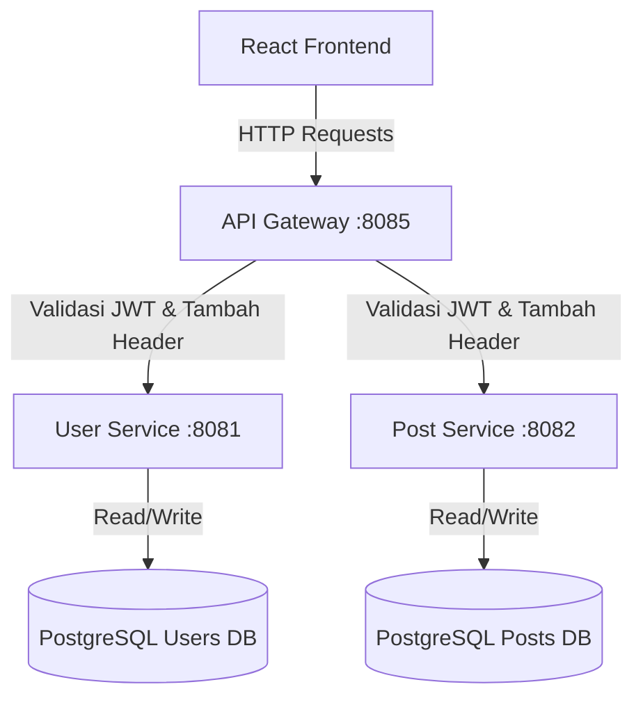

# Go-React Microservices Blog Platform

Platform blog ini adalah aplikasi modern yang dibangun menggunakan arsitektur microservices dengan backend **Go (Golang)** dan frontend **React**. Sistem ini mendemonstrasikan praktik terbaik dalam desain skalabilitas, pemisahan database (*Database per Service*), manajemen state frontend yang efisien, dan keamanan API berbasis Gateway.

## 🏗 Arsitektur Sistem

Aplikasi ini dipecah menjadi beberapa layanan independen yang diorkestrasi menggunakan Docker Compose.



### 1. Frontend (React + TypeScript)
- Dibangun menggunakan **React**, dikombinasikan dengan **TailwindCSS** untuk styling utilitas dan **Ant Design** untuk komponen interaktif (seperti notifikasi).
- **Fitur Utama**:
  - **Optimistic UI Updates**: Memanipulasi state lokal secara langsung setelah operasi CRUD berhasil tanpa men-download ulang seluruh data dari server, sangat menghemat *bandwidth*.
  - **Manajemen Tab**: Menyaring tampilan antara "Semua Post" (Publik) dan "Post Saya" secara instan.
  - Interceptor Axios untuk menyisipkan token JWT secara otomatis pada setiap request yang membutuhkan otentikasi.

### 2. Backend Microservices (Go)
Seluruh backend menggunakan bahasa Go dan berjalan di dalam container Docker yang terisolasi.

#### A. API Gateway (`:8085`)
- Berperan sebagai pintu masuk tunggal (Entrypoint) untuk semua request dari frontend.
- Menangani **CORS**.
- **Middlewares / Authentication**: Mencegat request menuju *protected routes* (seperti buat post, edit, atau hapus). Gateway memvalidasi token JWT, membongkar *claims*-nya, lalu meneruskan informasi user (`X-User-ID`, `X-User-Name`, `X-User-Email`) ke service di belakangnya.

#### B. User Service (`:8081`)
- Bertanggung jawab atas manajemen identitas (Register, Login, Profile).
- Menggunakan `bcrypt` untuk enkripsi password.
- Menghasilkan token JWT saat login sukses.
- Memiliki database **PostgreSQL terisolasi (`users_db`)**.

#### C. Post Service (`:8082`)
- Bertanggung jawab penuh atas manajemen konten/postingan (CRUD).
- **Struktur Kode Bersih**: Mengadopsi pemisahan file handler (base, create, get, update, delete) untuk mempermudah *maintenance*.
- **Otorisasi Ketat**: Memvalidasi kepemilikan postingan. Sebelum mengupdate atau menghapus data, service ini membandingkan `AuthorID` di database dengan `X-User-ID` yang diteruskan oleh API Gateway. Menghasilkan error `403 Forbidden` jika identitas tidak cocok.
- Memiliki database **PostgreSQL terisolasi (`posts_db`)**.

## 🚀 Panduan Menjalankan Aplikasi

Pastikan sistem Anda telah terinstal **Docker**, **Docker Compose**, dan **Node.js**.

### Menjalankan Backend (Docker)
1. Buka terminal dan masuk ke direktori microservice:
   ```bash
   cd go-microservice
   ```
2. Bangun dan jalankan semua container di *background*:
   ```bash
   docker compose up --build -d
   ```
3. API Gateway kini berjalan dan bisa diakses frontend di `http://localhost:8085`.

### Menjalankan Frontend
1. Buka terminal baru dan masuk ke direktori frontend:
   ```bash
   cd frontend
   ```
2. Instal dependensi NPM:
   ```bash
   npm install
   ```
3. Jalankan server pengembangan lokal:
   ```bash
   npm run dev
   ```
4. Buka browser Anda dan akses aplikasi di **`http://localhost:5173`**.

## 🔒 Keamanan (Security Highlights)
- **Token-Based Auth**: Tidak menggunakan session cookies, melainkan token JWT *stateless* yang berlaku 24 jam.
- **Header Forwarding Pattern**: Downstream service (seperti post-service) tidak perlu menembak API user-service untuk memvalidasi user. Identitas sudah dipastikan valid dan diteruskan secara aman via HTTP headers internal dari Gateway.
- **Resource Protection**: Backend menolak manipulasi data secara langsung via Postman/curl jika pengguna tidak sah mencoba menghapus/mengubah postingan milik orang lain.
